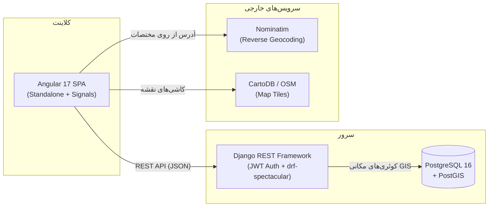

<div align="center">

# 🗺️ شهر من | My City

### سامانه ثبت و پیگیری مشکلات شهری با نقشه زنده و پنل مدیریت

### Citizen-reported urban issue tracking platform with live GIS map & admin dashboard

[](https://www.djangoproject.com/)
[](https://www.django-rest-framework.org/)
[](https://postgis.net/)
[](https://angular.dev/)
[](https://www.typescriptlang.org/)
[](https://leafletjs.com/)
[](https://www.docker.com/)

[دمو زنده](#-دمو--screenshots) · [نصب سریع](#-شروع-سریع) · [مستندات API](#-مستندات-api) · [English version below ↓](#-my-city-english)

</div>

---

# 🇮🇷 شهر من (فارسی)

## 📌 معرفی

**شهر من** یک پلتفرم فول‌استک است که به شهروندان اجازه می‌دهد مشکلات شهری (چاله، چراغ خیابانی خراب، زباله، ترک جدول، گرافیتی، نشتی آب و ...) را به‌همراه **عکس و موقعیت دقیق مکانی** روی نقشه ثبت کنند. اپراتورهای شهرداری گزارش‌ها را در یک **داشبورد مدیریتی با نمودارهای تحلیلی** بررسی، اولویت‌بندی و پیگیری می‌کنند و شهروند وضعیت گزارش خود را به‌صورت زنده (با تاریخچه کامل تغییرات) مشاهده می‌کند.

این پروژه به‌عنوان یک نمونه‌کار (portfolio project) طراحی شده تا توانایی پیاده‌سازی یک سیستم **GIS-محور، فول‌استک و آماده تولید (production-ready)** را نشان دهد — از مدل‌سازی داده‌های مکانی در PostGIS تا تجربه کاربری Real-time روی نقشه.

## ✨ ویژگی‌های کلیدی

### 🗺️ نقشه و GIS

- ثبت لوکیشن با کلیک روی نقشه یا دکمه «موقعیت من» (Geolocation API)
- **Clustering** خودکار مارکرها در زوم‌های پایین برای خوانایی بهتر
- فیلتر خودکار گزارش‌ها بر اساس محدوده نمایی نقشه (Bounding Box) با کوئری مکانی PostGIS
- لایه **Heatmap** قابل فعال/غیرفعال‌سازی برای دیدن تراکم مشکلات
- **Reverse Geocoding** خودکار (تبدیل مختصات به آدرس متنی) با Nominatim/OpenStreetMap — بدون نیاز به API Key
- سیستم **Fallback خودکار منبع نقشه**: اگر یک ارائه‌دهنده تایل (CartoDB) در دسترس نباشد، به‌صورت هوشمند و خودکار به منبع جایگزین (Positron → OSM) سوییچ می‌کند
- پاپ‌آپ‌ها و مارکرهای کاملاً سفارشی‌سازی‌شده (نه ظاهر خام Leaflet)

### 👤 حساب کاربری و نقش‌ها

- احراز هویت مبتنی بر **JWT** (Access + Refresh Token) با تمدید خودکار توکن
- سه نقش: **شهروند**، **اپراتور**، **ادمین** با سطح دسترسی متفاوت
- شهروند فقط گزارش‌های خودش (پیش از بررسی) را می‌تواند ویرایش کند

### 📋 مدیریت گزارش‌ها

- ویزارد ثبت گزارش ۴ مرحله‌ای (دسته‌بندی ← لوکیشن ← جزئیات و عکس ← بازبینی نهایی)
- **تاریخچه کامل تغییر وضعیت** هر گزارش (چه کسی، چه زمانی، چرا تغییر داد)
- بخش نظرات روی هر گزارش
- اعتبارسنجی سمت سرور برای آپلود عکس (حداکثر ۵ مگابایت، فقط JPG/PNG/WebP)
- محدودیت نرخ ثبت گزارش (Rate Limiting) برای جلوگیری از سوءاستفاده

### 📊 داشبورد مدیریتی

- کارت‌های KPI (تعداد کل، تفکیک وضعیت)
- نمودار دونات وضعیت، نمودار ستونی دسته‌بندی، نمودار روند ۶ ماهه (ApexCharts)
- جدول مدیریت با قابلیت تغییر وضعیت Inline

### 🎨 تجربه کاربری

- طراحی **کاملاً فارسی و RTL** با فونت Vazirmatn
- ریسپانسیو کامل؛ در موبایل فیلترها به‌صورت Bottom Sheet نمایش داده می‌شوند
- اسکلتون لودینگ، Toast، Empty State، انیمیشن‌های ورود پلکانی

## 🖼 دمو / Screenshots

> برای اضافه کردن اسکرین‌شات واقعی: چند تصویر از صفحات نقشه، ویزارد ثبت گزارش و داشبورد بگیرید و در پوشه `docs/screenshots/` قرار دهید، سپس لینک‌شان را اینجا جایگزین این بخش کنید.

```
docs/screenshots/map.png
docs/screenshots/report-wizard.png
docs/screenshots/admin-dashboard.png
```

## 🏗 معماری



## 🛠 استک فناوری

| لایه        | فناوری                                                                   |
| ----------- | ------------------------------------------------------------------------ |
| بک‌اند      | Python 3.11 · Django 5 · Django REST Framework                           |
| دیتابیس     | PostgreSQL 16 + PostGIS 3.4 (کوئری‌های مکانی: `dwithin`, bbox filtering) |
| احراز هویت  | JWT — `djangorestframework-simplejwt`                                    |
| مستندات API | `drf-spectacular` (Swagger UI / OpenAPI)                                 |
| فرانت‌اند   | Angular 17 (Standalone Components) · TypeScript (strict mode)            |
| استایل      | Tailwind CSS · فونت Vazirmatn                                            |
| نقشه        | Leaflet · leaflet.markercluster · leaflet.heat                           |
| نمودار      | ng-apexcharts                                                            |
| آیکون       | lucide-angular                                                           |
| زیرساخت     | Docker Compose (db + backend + frontend)                                 |

## 📂 ساختار پروژه

```
shahre-man/
├── backend/                   # Django REST API
│   ├── apps/
│   │   ├── users/              # مدل کاربر سفارشی، JWT، نقش‌ها
│   │   ├── categories/         # دسته‌بندی مشکلات شهری
│   │   └── reports/            # گزارش‌ها، تاریخچه وضعیت، نظرات
│   ├── stats/                   # آمار KPI برای داشبورد
│   ├── core/                    # pagination، validators، utils
│   ├── scripts/seed_data.py     # داده نمونه (۶ دسته، ۳ کاربر تست، ۵۰ گزارش)
│   └── config/                  # تنظیمات Django
│
├── frontend/                   # Angular 17 SPA
│   └── src/app/
│       ├── core/                # سرویس‌ها، گاردها، اینترسپتورها، مدل‌ها
│       ├── shared/               # کامپوننت‌های مشترک (Navbar, Toast, ...)
│       └── features/
│           ├── map/              # نقشه اصلی + Leaflet service
│           ├── report-wizard/    # ویزارد ثبت گزارش ۴ مرحله‌ای
│           ├── report-detail/    # جزئیات + تایم‌لاین + نظرات
│           ├── admin-dashboard/  # KPI + نمودارها + جدول مدیریت
│           └── ...
│
├── docker-compose.yml
└── .env.example
```

## 🚀 شروع سریع

### پیش‌نیاز

[Docker](https://www.docker.com/products/docker-desktop/) و Docker Compose نصب باشند.

```bash
git clone https://github.com/<your-username>/shahre-man.git
cd shahre-man
cp .env.example .env
docker compose up --build
```

پس از بالا آمدن سرویس‌ها:

| سرویس           | آدرس                           |
| --------------- | ------------------------------ |
| فرانت‌اند       | http://localhost:4200          |
| API بک‌اند      | http://localhost:8000/api/v1   |
| مستندات Swagger | http://localhost:8000/api/docs |
| پنل ادمین جنگو  | http://localhost:8000/admin    |

### 👤 حساب‌های تست (به‌صورت خودکار ساخته می‌شوند)

| نقش     | نام کاربری | رمز عبور        |
| ------- | ---------- | --------------- |
| ادمین   | `admin`    | `Admin@1234`    |
| اپراتور | `operator` | `Operator@1234` |
| شهروند  | `citizen`  | `Citizen@1234`  |

## 📡 مستندات API

پیشوند همه مسیرها: `/api/v1/`

| متد     | مسیر                                 | توضیح                                                                             | دسترسی         |
| ------- | ------------------------------------ | --------------------------------------------------------------------------------- | -------------- |
| `POST`  | `/auth/register/`                    | ثبت‌نام کاربر جدید                                                                | عمومی          |
| `POST`  | `/auth/login/`                       | ورود (دریافت access/refresh token)                                                | عمومی          |
| `POST`  | `/auth/refresh/`                     | تمدید access token                                                                | عمومی          |
| `GET`   | `/auth/me/`                          | اطلاعات کاربر لاگین‌شده                                                           | احراز هویت‌شده |
| `GET`   | `/categories/`                       | لیست دسته‌بندی‌ها                                                                 | عمومی          |
| `GET`   | `/reports/`                          | لیست گزارش‌ها (فیلتر: `status`, `category`, `bbox`, `search`, `mine`, `ordering`) | عمومی          |
| `POST`  | `/reports/`                          | ثبت گزارش جدید (multipart: عکس + مختصات)                                          | احراز هویت‌شده |
| `GET`   | `/reports/{id}/`                     | جزئیات یک گزارش                                                                   | عمومی          |
| `PATCH` | `/reports/{id}/status/`              | تغییر وضعیت گزارش                                                                 | اپراتور/ادمین  |
| `POST`  | `/reports/{id}/comments/`            | افزودن نظر                                                                        | احراز هویت‌شده |
| `GET`   | `/reports/nearby/?lat=&lng=&radius=` | گزارش‌های نزدیک یک نقطه (کوئری `dwithin` در PostGIS)                              | عمومی          |
| `GET`   | `/reports/heatmap/`                  | داده خام برای لایه Heatmap                                                        | عمومی          |
| `GET`   | `/stats/overview/`                   | KPIهای داشبورد                                                                    | عمومی          |

مستندات تعاملی کامل (قابل تست مستقیم): **`/api/docs`**

## 🔐 امنیت

- شهروند فقط گزارش خودش را در وضعیت «جدید» می‌تواند ویرایش کند
- تغییر وضعیت گزارش فقط برای اپراتور/ادمین مجاز است
- اعتبارسنجی سرور روی حجم و فرمت عکس
- محدودیت نرخ ثبت گزارش (۲۰ درخواست در ساعت)
- CORS محدود به دامنه فرانت‌اند مشخص‌شده در `.env`

## 🗺 نقشه راه (Roadmap)

- [ ] اعلان Push هنگام تغییر وضعیت گزارش
- [ ] اپلیکیشن موبایل (PWA)
- [ ] پشتیبانی چندشهر / چندمنطقه با محدوده جغرافیایی مجزا
- [ ] Export گزارش‌ها به CSV/Excel برای اپراتورها

## 📄 لایسنس

این مخزن فعلاً بدون لایسنس مشخص منتشر شده است. در صورت نیاز به استفاده عمومی/تجاری، یک فایل `LICENSE` (مثلاً MIT) به مخزن اضافه کنید.

---

<br>

# 🇬🇧 My City (English)

## Overview

**My City** is a full-stack platform that lets citizens report urban issues (potholes, broken streetlights, garbage, cracked curbs, graffiti, water leaks, etc.) with a **photo and precise geolocation** on a live map. Municipal operators triage and track reports through an **analytics-driven admin dashboard**, while citizens follow their report's status in real time, including a complete change history.

Built as a portfolio project to demonstrate a **GIS-driven, production-style full-stack system** — from spatial data modeling in PostGIS to a real-time map experience on the frontend.

## Key Features

**GIS & Mapping**

- Pin-drop location selection (map click or "my location" geolocation button)
- Automatic marker clustering at low zoom levels
- Bounding-box based report filtering, powered by PostGIS spatial queries
- Toggleable heatmap layer
- Automatic reverse geocoding via Nominatim/OpenStreetMap (no API key required)
- **Automatic tile-provider fallback**: if the primary map tile source (CartoDB) becomes unavailable, the app automatically switches to a backup provider (Positron → OSM) with zero user intervention
- Fully custom-styled markers and popups

**Accounts & Roles**

- JWT authentication (access + refresh) with automatic silent renewal
- Three roles: Citizen, Operator, Admin, each with distinct permissions

**Report Management**

- 4-step guided report submission wizard
- Full status change history per report (who, when, why)
- Comments per report
- Server-side image validation (5MB max, JPG/PNG/WebP only)
- Rate-limited report creation to prevent abuse

**Admin Dashboard**

- KPI cards, status donut chart, category bar chart, 6-month trend line chart (ApexCharts)
- Inline status management table

**UX**

- Fully Persian/RTL interface with Vazirmatn font
- Fully responsive; filters render as a mobile bottom sheet
- Skeleton loaders, toasts, empty states, staggered entry animations

## Tech Stack

| Layer    | Technology                                                               |
| -------- | ------------------------------------------------------------------------ |
| Backend  | Python 3.11 · Django 5 · Django REST Framework                           |
| Database | PostgreSQL 16 + PostGIS 3.4 (spatial queries: `dwithin`, bbox filtering) |
| Auth     | JWT via `djangorestframework-simplejwt`                                  |
| API Docs | `drf-spectacular` (Swagger UI / OpenAPI)                                 |
| Frontend | Angular 17 (Standalone Components) · TypeScript strict mode              |
| Styling  | Tailwind CSS                                                             |
| Maps     | Leaflet · leaflet.markercluster · leaflet.heat                           |
| Charts   | ng-apexcharts                                                            |
| Icons    | lucide-angular                                                           |
| Infra    | Docker Compose (db + backend + frontend)                                 |

## Quick Start

Requires [Docker](https://www.docker.com/products/docker-desktop/) and Docker Compose.

```bash
git clone https://github.com/<your-username>/shahre-man.git
cd shahre-man
cp .env.example .env
docker compose up --build
```

| Service      | URL                            |
| ------------ | ------------------------------ |
| Frontend     | http://localhost:4200          |
| Backend API  | http://localhost:8000/api/v1   |
| Swagger docs | http://localhost:8000/api/docs |
| Django admin | http://localhost:8000/admin    |

### Demo accounts (seeded automatically)

| Role     | Username   | Password        |
| -------- | ---------- | --------------- |
| Admin    | `admin`    | `Admin@1234`    |
| Operator | `operator` | `Operator@1234` |
| Citizen  | `citizen`  | `Citizen@1234`  |

## API Reference

Base prefix: `/api/v1/`. Full interactive docs at **`/api/docs`**.

| Method  | Path                                 | Description                                                                        | Access         |
| ------- | ------------------------------------ | ---------------------------------------------------------------------------------- | -------------- |
| `POST`  | `/auth/register/`                    | Register a new user                                                                | Public         |
| `POST`  | `/auth/login/`                       | Login (returns access/refresh tokens)                                              | Public         |
| `POST`  | `/auth/refresh/`                     | Refresh access token                                                               | Public         |
| `GET`   | `/auth/me/`                          | Current user info                                                                  | Authenticated  |
| `GET`   | `/categories/`                       | List issue categories                                                              | Public         |
| `GET`   | `/reports/`                          | List reports (filters: `status`, `category`, `bbox`, `search`, `mine`, `ordering`) | Public         |
| `POST`  | `/reports/`                          | Create a report (multipart: photo + coordinates)                                   | Authenticated  |
| `GET`   | `/reports/{id}/`                     | Report detail                                                                      | Public         |
| `PATCH` | `/reports/{id}/status/`              | Update report status                                                               | Operator/Admin |
| `POST`  | `/reports/{id}/comments/`            | Add a comment                                                                      | Authenticated  |
| `GET`   | `/reports/nearby/?lat=&lng=&radius=` | Nearby reports (PostGIS `dwithin`)                                                 | Public         |
| `GET`   | `/reports/heatmap/`                  | Raw heatmap data                                                                   | Public         |
| `GET`   | `/stats/overview/`                   | Dashboard KPIs                                                                     | Public         |

## Security

- Citizens can only edit their own reports while still in "new" status
- Status changes are restricted to Operator/Admin roles
- Server-side image validation (size + MIME type)
- Rate-limited report creation (20/hour)
- CORS restricted to the configured frontend origin

## Roadmap

- [ ] Push notifications on status change
- [ ] Progressive Web App (mobile)
- [ ] Multi-city / multi-region support with separate bounding areas
- [ ] CSV/Excel export for operators

## License

No license has been added to this repository yet. Add a `LICENSE` file (e.g. MIT) if you intend to open it up for public/commercial use.

---

<div align="center">

ساخته‌شده با ❤️ — Built with ❤️

</div>
